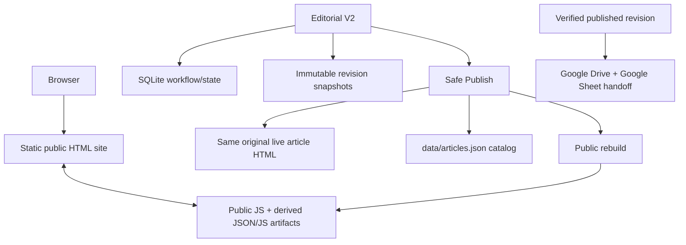

# Kiến trúc hệ thống

> **Canonical — current.** Mô tả dưới đây được rút từ mã hiện tại; Git history
> và tài liệu historical không thay thế implementation.

## Tổng quan



Public pages remain static HTML. Editorial V2 is a PHP application used to
manage collaborative workflow and to publish safely back into the same public
article file.

## Public site

The public site is a filesystem-backed static site:

- many root-level `*.html` files are article/detail pages, alongside homepage,
  hubs and other public pages;
- `thu-vien.html` and `ban-tin.html` are public content hubs;
- paginated hub pages live below `thu-vien/trang/` and `ban-tin/trang/`;
- `assets/`, `article-layout.js` and `article-sidebar.js` provide public
  presentation behavior;
- public article JS reads derived data such as
  `data/article-views/<article-id>.json`.

The repository also includes redirect rules and public assets. Do not list or
manually edit large sets of article files when a catalog/rebuild path is the
correct mechanism.

## Canonical data and authority matrix

| Domain | Current authority / role | Notes |
|---|---|---|
| Live public article content | Original live article HTML file | Safe Publish writes this same file after validation and atomic replacement. |
| Article catalog | `data/articles.json` | Canonical catalog metadata consumed by Editorial and public rebuild; Publish updates the matching article record. |
| Public taxonomy source | `data/taxonomy-master.json` when present for taxonomy rebuild | Public/editor taxonomy and menu artifacts are generated from the master plus catalog counts. |
| Editorial workflow | `editorial/storage/editorial.sqlite` | Users, state, assignment, locks, drafts, revision rows, audit, settings and handoff sync. Not public prose storage. |
| Revision content/evidence | JSON snapshots under `editorial/storage/revisions/` | Immutable payload records, checked against stored content hashes. |
| Media binaries | `uploads/articles/YYYY/MM/` | Public files; payloads and snapshots store paths/references, not duplicate image binaries. |
| Public derived data | `content-index.js`, `data/hubs/`, `data/article-views/`, feeds, taxonomy/editor-taxonomy/menu artifacts, `sitemap.xml` | Rebuild outputs; do not treat them as the source article body. |
| Publication readiness | `editorial/storage/public-ready/<hash>.json` | Marker binds exact article ID, published revision and live hash after rebuild succeeds. |
| External archive | Google Drive + Google Sheet | Archive/handoff of the verified published version, not a source for publish or draft. |

## Major components

### Public Site

Static HTML, public assets, content hubs and derived JSON/JS artifacts. It is
the delivery layer seen by website visitors.

### Legacy Admin

`admin/` is a separate PHP legacy/fallback subsystem. It has its own history and
documentation. Editorial V2 must not runtime-depend on it.

### Editorial V2

`editorial/` implements current collaborative editing:

- authentication and roles;
- ownership/assignment and workspace locks;
- drafts and immutable revisions;
- stage milestones, review and approval;
- Safe Publish to the live article;
- public rebuild and exact image verification;
- Google Drive + Sheet archive of published content.

### Build / Rebuild tools

`tools/` contains focused CLI utilities. In particular,
`tools/rebuild_public_from_articles.py` can regenerate public data artifacts.
Taxonomy-related tools use `data/taxonomy-master.json` when that authority is
available.

## Data flow

```text
Live HTML + data/articles.json
        ↓ read
Editorial Workspace
        ↓ save
SQLite draft (per article/user)
        ↓ snapshot
Immutable revision / stage / review evidence
        ↓ Safe Publish
Same live HTML + data/articles.json + published revision
        ↓ public rebuild
Derived public artifacts + public-ready marker
        ↓ eligible handoff
Google Drive HTML archive + Google Sheet row
```

Important distinction: a draft is workflow state; a revision is immutable
evidence; publication facts describe what is live; public artifacts are derived
delivery data.

## Derived public artifacts

The current rebuild implementation writes or refreshes the following families
as applicable:

- `content-index.js`;
- `data/hubs/thu-vien.json` and `.js`;
- `data/hubs/ban-tin.json` and `.js`;
- `data/feeds/latest-thu-vien.json`;
- `data/feeds/latest-ban-tin.json`;
- target or full `data/article-views/*.json` and `.js`;
- `data/taxonomy.json`;
- `data/editor-taxonomy.json`;
- `data/menu-config.json`;
- `sitemap.xml`.

The normal Publish fast path updates affected public data without recomputing
taxonomy; a full rebuild can refresh taxonomy through the configured builder.
See [PUBLISH_AND_HANDOFF.md](PUBLISH_AND_HANDOFF.md).

## Security boundaries

| Boundary | Implementation concept |
|---|---|
| Authentication / roles | Editorial session revalidation and `editorial_require_auth()` / `editorial_require_role()`. |
| CSRF | POST endpoints use Editorial CSRF validation. |
| Ownership | `assigned_user_id` plus active-assignment consistency. |
| Concurrency | SQLite `BEGIN IMMEDIATE` transactions for write flows. |
| Workspace session | Temporary article lock with token and expiry. |
| Revision evidence | Snapshot path, article ID and content hash verification. |
| Live drift | SHA-256 base/live hash checks before destructive Publish and controlled reopen. |
| File writes | Temp-file + rename style atomic writes/replacements, backup and compensation in Publish. |
| Storage exposure | `editorial/storage/.htaccess` denies public access; deployment must preserve an equivalent deny rule. |
| External integration | Server-side settings and verified Composio tool schemas; secrets are not returned to browser-facing callers. |

## Legacy boundary

`/admin` remains independent fallback/legacy code. Editorial bootstrap does not
load or modify legacy Admin business logic. A change targeting Editorial V2
should normally stay under `editorial/`, its canonical docs, and the relevant
public data/rebuild contract—not under `/admin`.
