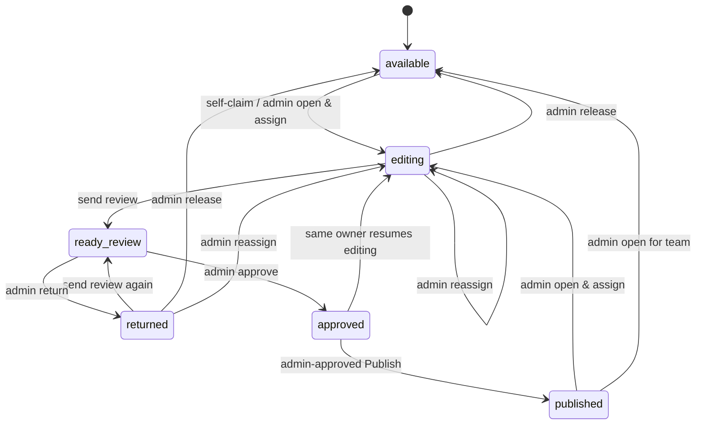

# Editorial V2

> **Canonical — current functional and technical reference.**
> Entry point: [`../editorial/README.md`](../editorial/README.md).

## Purpose

Editorial V2 is the current collaborative PHP workflow for editing existing
public HTML articles without replacing the static public-site architecture.
It manages people, workflow, drafts and evidence; Safe Publish writes the
validated result back to the original live HTML article.

## Roles

| Role | Main authority |
|---|---|
| Editor | Claim an explicitly available article; work only on owned editing/returned articles; save draft, create revisions/stages, request review, and use Editor Direct Publish when its server-side checks pass. |
| Admin | Review/approve/return, terminal Publish, user management, integrity view, Handoff configuration, release/reassign active work, and controlled reopen of a Published article. |

All role checks must remain server-side. A hidden or absent UI control is not
an authorization boundary.

## State machine



Actual state names:

- `available`
- `editing`
- `ready_review`
- `returned`
- `approved`
- `published`

### Nuance: workflow status và publication facts

Editor Direct Publish không bắt buộc chuyển workflow sang `published`. Nó ghi
publication facts cho phiên bản live mới, nhưng có thể giữ assignment, lock,
draft và status `editing`/`returned`. Ngược lại, Admin-approved Publish là
terminal: state trở thành `published`, owner bị xóa và assignment active đóng.

Do đó workflow ownership và last-publication facts là hai khái niệm độc lập.

## Ownership model

Current ownership / assignment pointer là:

```text
editorial_article_state.assigned_user_id
```

Assignment history chỉ giải thích ai từng làm bài. Contributor lịch sử không có
quyền mở Workspace, lưu Draft, upload media, gửi duyệt hay Publish.

`assigned_user_id` xác định current owner, nhưng không tự nó cấp quyền cho mọi
write. Mỗi service còn kiểm tra tổ hợp phù hợp của workflow status, active
assignment, role/policy, CSRF và lock token/expiry khi operation yêu cầu lock.

### Self-claim

`editorial_claim_article()` trong `editorial/includes/assignment.php` chỉ cho
tự nhận khi tất cả điều kiện sau đúng trong transaction:

1. state là `available`;
2. `assigned_user_id` rỗng;
3. không có active assignment;
4. live HTML vẫn đọc/băm được.

Nếu state đang thiếu nhưng bài đã có assignment history, Claim fail-closed thay
vì giả định đây là bài mới. Một bài thật sự chưa từng có state/lịch sử mới được
tạo state `available` rồi nhận.

### Admin ownership actions

`editorial/includes/review.php` giữ các hành động Admin:

| Tình huống | Hành động |
|---|---|
| `editing` / `returned` | Reassign sang user active khác; mặc định giữ draft safety. |
| `editing` / `returned` | Release về `available`; vẫn giữ publication facts. |
| `published`, không owner | Mở lại & giao: tạo assignment mới, chuyển `editing`. |
| `published`, không owner | Mở lại cho nhóm: chuyển `available` để Editor tự claim. |

Reassign/release không áp dụng casually cho `ready_review`; Admin phải return
trước nếu cần đổi người. `approved → editing` chỉ là luồng resume của cùng
owner.

## Lock model

Workspace lock là khóa tạm thời theo article/user/token:

- chỉ owner ở `editing` hoặc `returned` lấy/giữ lock;
- lock có heartbeat và expiry;
- mọi ghi draft xác nhận lock lại trong transaction;
- tab cũ không thể xóa lock mới vì release cần đúng lock token;
- thoát Workspace chỉ release lock, **không** release assignment.

Code pointer: `editorial/includes/workspace.php`.

## Draft model

Draft được lưu theo cặp `article_id` + `user_id` trong SQLite:

- payload là dữ liệu biên tập đã chuẩn hóa;
- `version` hỗ trợ optimistic concurrency;
- save kiểm tra state, owner, lock và active assignment trong transaction;
- stale-version recovery chỉ reuse khi persisted content đã tương đương, nếu
  không vẫn dùng conditional update để tránh ghi đè race;
- draft save đánh dấu `first_saved_at`/`last_saved_at` cho assignment history.

Taxonomy trong payload được giữ từ catalog authority; Workspace không phải taxonomy
editor.

## Revision model

Revision là evidence bất biến:

| Loại / thành phần | Ý nghĩa |
|---|---|
| Baseline | Snapshot từ live HTML lúc bắt đầu assignment. |
| Editorial revision | Snapshot từ draft đã lưu. |
| Published revision | Snapshot payload đã thực sự Publish. |
| `content_hash` | Hash canonical của payload. |
| `assignment_id` | Gắn evidence với một chu kỳ ownership. |
| `source_draft_version` | Liên hệ revision với version draft nguồn. |
| `milestone_key` | `stage1` hoặc `stage2` nếu revision là milestone. |

Snapshot JSON nằm trong `editorial/storage/revisions/`, được shard theo hash của
article ID. Code kiểm tra schema, article ID, payload shape và content hash trước
khi dùng snapshot như authority.

Code pointer: `editorial/includes/revision.php`.

## Stage model

Stage không phải mutable save slot. Chúng là revision milestone bất biến trong
assignment hiện tại:

```text
Baseline → Active Stage1 → Active Stage2 (optional outside review)
```

- Active Stage1 là Stage1 verified mới nhất của assignment.
- Active Stage2 là Stage2 verified mới nhất có revision number lớn hơn Active
  Stage1.
- Nếu Editor tạo lại Stage1 sau Active Stage2, Stage2 cũ vẫn là lịch sử bất
  biến nhưng không còn active; một Stage2 mới sẽ cần tạo nếu luồng sau đó yêu
  cầu.
- Milestone trùng payload verified có thể được reuse thay vì tạo evidence trùng.

## Compare

`editorial/compare.php` là màn hình GET/read-only:

- chỉ đọc revision thuộc bài và kiểm tra snapshot;
- tạo preview từ snapshot immutable;
- live HTML chỉ là presentation context cho preview;
- không lưu draft, không tạo revision và không thay đổi state.

## Review

Review service ở `editorial/includes/review.php`:

1. Editor gửi review từ `editing` hoặc `returned`.
2. Hệ thống yêu cầu bundle verified: Baseline, Stage1, Stage2.
3. Content hash draft phải bằng Active Stage2.
4. State lưu `review_revision_id`, người yêu cầu và thời điểm.
5. Editor có thể gửi kèm ghi chú tối đa 2.000 ký tự. Ghi chú được lưu trong
   event `article.review.submitted`, gắn với đúng `revision_id`; nó không sửa
   snapshot immutable và không tham gia content hash.
6. Admin review cockpit ưu tiên hiển thị tiêu đề, trạng thái, người gửi, thời
   điểm, revision, tính toàn vẹn, ghi chú và hai đối chiếu
   **Bài gốc ↔ Chặng 1** / **Bài gốc ↔ Chặng 2**.
7. Admin approve hoặc return với evidence review. Return vẫn bắt buộc lý do.

Nếu một bài bị trả rồi gửi lại, UI phải lấy event gửi duyệt mới nhất của chính
`review_revision_id` đang xem; không dùng ghi chú của lần gửi cũ hoặc revision
khác.

Approved resume là ngoại lệ có kiểm soát: cùng owner với active assignment mới
được chuyển `approved → editing`.

## Direct Publish

Editor Direct Publish:

- chỉ dành cho current owner ở `editing`/`returned`;
- yêu cầu workspace lock hợp lệ;
- lấy candidate immutable từ **draft đã lưu trên server**, không dùng browser
  state chưa lưu;
- candidate phải khớp draft hash và draft version;
- không yêu cầu Stage như review flow;
- Publish thành công vẫn là non-terminal với ownership/workflow active.

## Admin-approved Publish

Admin-approved Publish:

- chỉ dành cho Admin active;
- yêu cầu state `approved` và `approved_revision_id` hợp lệ;
- yêu cầu assignment và live hash nhất quán;
- không chạy nếu còn workspace lock;
- Publish thành công đóng active assignment, xóa lock/draft active và chuyển
  state sang `published`.

Chi tiết destructive pipeline ở
[PUBLISH_AND_HANDOFF.md](PUBLISH_AND_HANDOFF.md).

## Publication facts

Các trường sau mô tả **last live public version**, không mô tả người đang edit:

- `published_revision_id`
- `published_by`
- `published_at`
- `published_live_hash`
- `publish_backup_path`

Chúng được giữ qua Claim, Release, Reassign và Admin reopen. Khi bắt đầu cycle
mới, các pointer workflow như `current_revision_id`, review/approval pointer và
`base_live_hash` có thể reset/đổi; publication facts không được xóa chỉ vì đổi
ownership.

## Module map

| Module | Responsibility / concepts |
|---|---|
| `bootstrap.php` | Base/storage/database/catalog constants, module bootstrap, schema startup, session. |
| `helpers.php` | URL, HTML escaping, CSRF, flash, request/context helpers. |
| `database.php` | PDO SQLite, foreign keys, WAL, `BEGIN IMMEDIATE` transaction wrapper. |
| `auth.php` | Login/session revalidation, roles, CSRF enforcement, user CRUD, activity logging. |
| `article_catalog.php` | `data/articles.json` read/normalize/filter, public taxonomy reading, safe article path/hash. |
| `assignment.php` | Status labels, state queries, self-claim, ownership and transition table, approved resume. |
| `workspace.php` | Parse live article, preview, locks, draft save/concurrency, payload merge. |
| `article_parser.php` | Không có module riêng trong Editorial V2 hiện tại; parse live article nằm trong `workspace.php`. |
| `revision.php` | Snapshot I/O/verification, baseline, editorial/published revision helpers, stages and compare diff. |
| `review.php` | Send/approve/return review, draft handoff safety, release/reassign/reopen actions. |
| `publish.php` | Safe Publish policy, preflight, render/validate, backup, atomic replace, compensation and catalog update. |
| `publication.php` | Determines whether current published state is eligible for external handoff. |
| `public_rebuild.php` | Rebuild derived public artifacts, target-image sync/verification, public-ready marker. |
| `handoff.php` | Published-only Drive/Sheet handoff, sync state, Sheet preflight/upsert/verification. |
| `media.php` | Image validation, safe filename and storage under `uploads/articles/YYYY/MM/`. |
| `settings.php` | Server-side handoff settings; prevents exposing secret API key to browser callers. |
| `composio.php` | Minimal Composio client and Google integration verification/schema handling. |
| `integrity.php` | Read-only scanner for state, revision, lock, draft, backup and live-hash inconsistencies. |
| `layout.php` | Editorial shell/navigation; uses legacy admin CSS plus Editorial-specific CSS. |
| `migrations.php` | Idempotent SQLite schema versioning/migrations. |

## Where to modify a feature

| Need | Start with |
|---|---|
| Claim / owner / status | `assignment.php`, then `articles.php` |
| Lock / draft / editor payload | `workspace.php`, `article.php` |
| Stage / revision / compare | `revision.php`, `revisions.php`, `compare.php` |
| Review / reassignment | `review.php`, `review.php` page, `articles.php` |
| Publish | `publish.php`, `article.php`, admin `editorial/publish.php` |
| Featured/body images | `media.php`, `upload.php`, `workspace.php`, publish/rebuild docs |
| Derived public data | `public_rebuild.php`, `tools/rebuild_public_from_articles.py` |
| Drive/Sheet | `publication.php`, `handoff.php`, `settings.php`, `composio.php` |
| Integrity diagnostics | `integrity.php`, `editorial/integrity.php` |

## Do not change casually

- state transitions or `assigned_user_id` authorization;
- active assignment uniqueness;
- lock-token validation;
- revision snapshot/hash verification;
- candidate authority for Publish;
- backup, atomic replace or compensation behavior;
- `published_*` preservation;
- public-ready marker contract;
- published-only Handoff source;
- taxonomy preservation;
- SQLite schema/migrations;
- public media path contract.

## Image metadata contract

Editorial V2 has no media database or media library. Image binary upload remains
a physical-file concern; editorial metadata follows the content representation.

### Inline / body image

Inline metadata remains inside `prose_html` and therefore naturally changes the
draft hash, revision content hash and Stage identity:

```html
<figure class="article-image" data-editorial-image-meta="1">
  
  <figcaption>
    <span class="article-image-caption">...</span>
    <span class="article-image-credit">Nguồn: ...</span>
  </figcaption>
</figure>
```

`figcaption`, caption span and credit span are omitted when their corresponding
plain-text value is empty. The `data-editorial-image-meta` marker identifies a
wrapper created by the metadata control; only that wrapper may be safely
unwrapped after both caption and credit are removed. Legacy figure markup is
not reinterpreted or mass-rewritten.

### Featured Image

Featured metadata has five payload fields:

```text
featured_image
featured_image_alt
featured_image_title
featured_image_caption
featured_image_credit
```

Workspace parses `image`, `imageAlt`, `imageTitle`, `imageCaption` and
`imageCredit` from `script#article-meta`. Missing values on a legacy article
become empty strings; Workspace does not fabricate stored metadata.

The metadata control requires non-empty Alt only when an Editor explicitly saves
that inline-image dialog. Existing untouched legacy images without Alt do not
globally block Save, Stage, Review or Publish.
